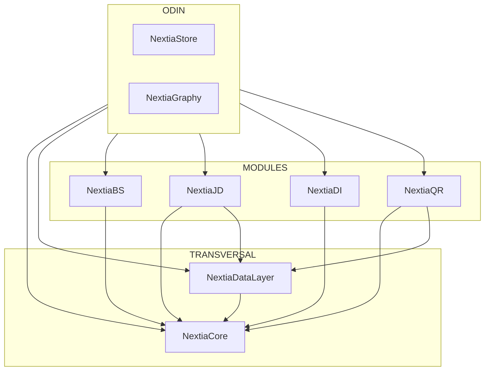

<h1 align="center">
  <a href="https://www.essi.upc.edu/dtim/odin/">
  </a>
</h1>
<a href="https://www.essi.upc.edu/dtim/tools/odin">
<h4 align="center">A dataspace management system</h4>
</a>

[](https://sonarcloud.io/dashboard?id=dtim-upc_newODIN)

# Project Onboarding Documentation

## Table of Contents

1. [Introduction](#introduction)
2. [Getting Started](#getting-started)
    - [Prerequisites](#prerequisites)
    - [Installation](#installation)
    - [Configuration](#configuration)
      - [Backend](#backend-configuration)
      - [Frontend](#frontend-configuration)
3. [Project Structure](#project-structure)
   - [Backend](#backend)
       - [Architecture](#backend-architecture)
       - [Code style](#code-style)
       - [Dependencies](#backend-dependencies)
   - [Frontend](#frontend)
       - [Architecture](#frontend-architecture)
       - [Dependencies](#frontend-dependencies)
4. [Usage](#usage)
5. [People](#people)
6. [Related links](#related-links)
7. [License](#license)

## Introduction <a name="introduction"></a>

Welcome to ODIN! This documentation is designed to help new developers quickly get started with the project and understand its architecture, dependencies, and configuration.

## Getting Started <a name="getting-started"></a>

### Prerequisites <a name="prerequisites"></a>

Before you begin, ensure that you have the following prerequisites installed:

- [Node.js](https://nodejs.org/) (version >=12.22.1)
- [NPM](https://docs.npmjs.com/cli/v8/commands/npm-install) (version >=6.14.12)
- [Yarn](https://classic.yarnpkg.com/lang/en/docs/install/#windows-stable) You can install it using `npm install -g yarn`
- [Quasar](https://quasar.dev/) (CLI >= 2.0) You can install it using `npm install -g @quasar/cli`
- [Gradle](https://gradle.org/) (version >=6.8)
- [Java](https://www.oracle.com/es/java/technologies/javase/jdk11-archive-downloads.html) (version 11)
- [Spark](https://spark.apache.org/downloads.html)

### Installation <a name="installation"></a>

1. Clone the repository:

   ```bash
   git clone https://github.com/dtim-upc/ODIN.git
   cd ODIN
   ```
   
2. Clone the others repositories used by ODIN:


   - [NextiaCore](https://github.com/dtim-upc/NextiaCore)
   ```bash
   git clone https://github.com/dtim-upc/NextiaCore.git
   ```


   - [NextiaDataLayer](https://github.com/dtim-upc/NextiaDataLayer) (ask for permissions)
   ```bash
   git clone https://github.com/dtim-upc/NextiaDataLayer.git
   ```


   - [NextiaBS](https://github.com/dtim-upc/NextiaBS)
   ```bash
   git clone https://github.com/dtim-upc/NextiaBS.git
   ```


   - [NextiaDI](https://github.com/dtim-upc/NextiaDI)
   ```bash
   git clone https://github.com/dtim-upc/NextiaDI.git
   ```


   - [NextiaJD2](https://github.com/dtim-upc/NextiaJD2) (ask for permissions)
   ```bash
   git clone https://github.com/dtim-upc/NextiaJD2.git
   ```


   - [NextiaQR](https://github.com/dtim-upc/NextiaQR) (ask for permissions)
   ```bash
   git clone https://github.com/dtim-upc/NextiaQR.git
   ```

### Configuration <a name="configuration"></a>

After following the previous steps [Prerequisites](#prerequisites) and [Installation](#installation). Lets ensemble everything to be able to compile and make ODIN run.

#### Backend <a name="backend-configuration"></a>

1. Generate the JAR folders of the Nextia projects:

   Execute for each Nextia project the Gradle task `uberJar`. This task will generate a zipped folder containing the compiled and optimized JAR files necessary for the seamless integration of Nextia functionalities within the ODIN system. The JAR generated will be located in the `build/libs` path of each project. 

   First, you should generate NextiaCore.jar because this JAR will be used by the other Nextia projects as a fundamental component, serving as a core library that provides essential functionalities and serves as a foundation for the remaining Nextia modules.

   Then, copy the NextiaCore.jar generated and paste it in the `./NextiaDataLayer/lib` folder to generate NextiaDataLayer.jar, which serves as a critical component utilized by both NextiaJD and ODIN. This JAR encapsulates data layer functionalities, ensuring seamless communication between NextiaJD and ODIN, and enabling efficient data management within the integrated system.

   Once you have the `NextiaCore.jar` and the `NextiaDataLayer.jar`, copy `NextiaCore.jar` in the `lib` folder, as before, of the other Nextia projects cloned (NextiaBS, NextiaJD, NextiaDI, NextiaQR). You must also copy `NextiaDataLayer.jar` in the same `lib` folder of NextiaJD.

   Now generate the remaining JARs: `NextiaBS.jar`, `NextiaDI.jar`, `NextiaJD.jar`, `NextiaQR.jar`.

    Note that NextiaQR it's optional right now.

2. Execute `importExternalJar` Gradle task of ODIN:

   This task will import automatically all the `NextiaXX.jar` needed by ODIN.
   Ensure that all Nextia projects are located under the same folder as ODIN. This organizational structure is essential for the importExternalJar Gradle task to effectively locate and import the generated JAR files from Nextia projects.

   Check that the JAR libraries have been imported into lib directory in ODIN/api.

3. Finally, execute `gradle bootRun` to start the application or open the project in Intellij IDE and run the main class `OdinApplication.java`.

#### Frontend <a name="frontend-configuration"></a>


## Project Structure <a name="project-structure"></a>

   The project structure is primarily divided into two code sections (backend and frontend) and a third section for documentation, where the UML diagram is located. To access the UML diagram, VisualParadigm is required.

   The code sections consist of two IntelliJ projects. Please note that access to IntelliJ Ultimate is available with a UPC email account.

### Backend <a name="backend"></a>

   ODIN's backend is developed in Java and utilizes the Spring framework. As the backend for ODIN, its primary role is to orchestrate calls to various Nextia libraries within the department. Each Nextia library serves a distinct functionality, and ODIN also manages application persistence.

   ODIN's persistence is bifurcated into two components: graph persistence, currently using Jena, and relational database persistence using ORM with the embedded H2 database.

   Among the "external" Nextia libraries (those requiring JAR import), the following are noteworthy:

   - NextiaCore: Contains domain class definitions for the system and serves as a cross-cutting library. It lacks business logic, focusing solely on Plain Old Java Object (POJO) classes. 

   - NextiaDataLayer: Manages an intermediate persistence layer for accessing data from uploaded datasets.

   - NextiaBS: Extracts schemas from datasets loaded into ODIN and generates wrappers, which are SQL queries demonstrating how to access the original dataset's data.

   - NextiaJD: Join discovery. Responsible for automatically discovering attribute alignments from datasets.

   - NextiaDI: Handles data integration. Given two schemas and alignments, it integrates them and generates the corresponding integrated graph.

   Internally within ODIN, there are NextiaStore and NextiaGraphy. The former manages persistence, while the latter generates a string representation for visually rendering graphs generated by NextiaBS in the frontend.

   The diagram described above would look like this:



#### Architecture <a name="backend-architecture"></a>
   
#### Code Style <a name="code-style"></a>


#### Dependencies <a name="backend-dependencies"></a>

   - NextiaCore.jar
   - NextiaDataLayer.jar
   - NextiaBS.jar
   - NextiaDI.jar
   - NextiaJD.jar
   - Spark

### Frontend <a name="frontend"></a>
#### Architecture <a name="frontend-architecture"></a>
#### Dependencies <a name="frontend-dependencies"></a>

## Usage <a name="usage"></a>


## People <a name="people"></a>

These researchers have significantly contributed to shaping ODIN into a more robust and feature-rich platform.
- Javier Flores
- Cristina Gómez
- Sergi Nadal
- Oscar Romero
- Marc Maynou
- Juan Emilio Olivan
- Víctor Asenjo
   

## Related links <a name="related-links"></a>


## License <a name="license"></a>

   This project is licensed under the [GNU General Public License v3.0]([https://opensource.org/license/mit/](https://www.gnu.org/licenses/gpl-3.0.html)https://www.gnu.org/licenses/gpl-3.0.html).

