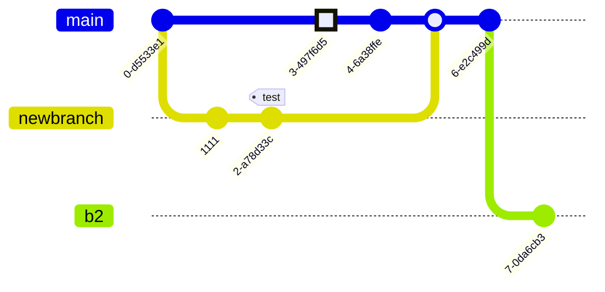

<h1 align="center">
  <a href="https://www.essi.upc.edu/dtim/odin/">
  </a>
</h1>
<a href="https://www.essi.upc.edu/dtim/tools/odin">
<h4 align="center">A dataspace management system</h4>
</a>

[](https://sonarcloud.io/dashboard?id=dtim-upc_newODIN)

# Project Onboarding Documentation

## Table of Contents

1. [Introduction](#introduction)
2. [Getting Started](#getting-started)
    - [Prerequisites](#prerequisites)
    - [Configuration](#configuration)
      - [Backend](#backend-configuration)
      - [Frontend](#frontend-configuration)
3. [Project Structure](#project-structure)
   - [Backend](#backend)
     - [Database division](#database-division)
     - [Architecture](#backend-architecture)
     - [Code style](#code-style)
   - [Frontend](#frontend)
       - [Architecture](#frontend-architecture)
       - [Dependencies](#frontend-dependencies)
4. [Demo](#demo)
5. [People](#people)
6. [Related links](#related-links)
7. [License](#license)

## Introduction <a name="introduction"></a>

Welcome to ODIN! This documentation is designed to help new developers quickly get started with the project and understand its architecture, dependencies, and configuration.

## Getting Started <a name="getting-started"></a>

### Prerequisites <a name="prerequisites"></a>

Before you begin, ensure that you have the following prerequisites installed:

- [Node.js](https://nodejs.org/) (version >=12.22.1)
- [NPM](https://docs.npmjs.com/cli/v8/commands/npm-install) (version >=6.14.12)
- [Yarn](https://classic.yarnpkg.com/lang/en/docs/install/#windows-stable) You can install it using `npm install -g yarn` (or on a macOS install it using Homebrew using `brew install yarn`)
- [Quasar](https://quasar.dev/) (CLI >= 2.0) You can install it using `npm install -g @quasar/cli`
- [Gradle](https://gradle.org/) (version >=6.8)
- [Java](https://www.oracle.com/es/java/technologies/javase/jdk11-archive-downloads.html) (version 11)
- [Spark](https://spark.apache.org/downloads.html): When installing Spark is it required to do a series of extra steps to make it work. We attach links to
    do generate a correct installation for [Windows](https://www.knowledgehut.com/blog/big-data/how-to-install-apache-spark-on-windows) 
    and [Linux (Ubuntu)](https://www.virtono.com/community/tutorial-how-to/how-to-install-apache-spark-on-ubuntu-22-04-and-centos/) systems.

Then, clone the repository:

   ```bash
   git clone https://github.com/dtim-upc/ODIN.git
   cd ODIN
   ```
   
### Configuration <a name="configuration"></a>

Lets ensemble everything to be able to compile and make ODIN run.

#### Backend <a name="backend-configuration"></a>

1. In the root folder execute the following command:

    ```bash
   gradlew build
   ```
    This will compile all the different modules and run their respective tests.

2. As of now, the best way to launch the application is to open the project in a Java IDE (e.g. IntelliJ) and execute the class OdinApplication.java.

##### Intent module
The Intents module is built with Python and, as such, can not be natively executed by ODIN. Instead, it offers an API
to which ODIN connects to and sends requests. To initialize this API go to `ODIN/Modules/IntentSpecification2WorkflowGenerator`
and execute the following command:

```bash
   flask --app api\api_main.py run    
   ```

#### Frontend <a name="frontend-configuration"></a>

1. Open in the terminal the `ODIN/frontend` folder.

2. Execute `npm install`.

3. Then, execute `yarn install` (on macOS it is possible you need to run `yarn install --ignore-engines`).

4. Finally, execute `quasar dev` (or on a macOS do it from the `node_modules` directory using `node_modules/@quasar/app-vite/bin/quasar dev`. This will open your browser with the URL http://localhost:9000/#/projects.

_Note: that you must have Quasar CLI as it's mentioned in the Prerequisites section. If there's an error like `Global Quasar CLI • ⚠️   Error  Unknown command "dev"`, it's because you are not in the correct path, or you don't have Quasar CLI installed._ 


## Project Structure <a name="project-structure"></a>

   The project structure is primarily divided into two code sections (backend and frontend) and a third section for documentation, where the UML diagram is located. To access the UML diagram, VisualParadigm is required.

   The code sections consist of two IntelliJ projects. Please note that access to IntelliJ Ultimate is available with a UPC email account.

### Backend <a name="backend"></a>

   ODIN's backend is developed in **Java** and utilizes the **Spring framework**. As the backend for ODIN, its primary role is to **orchestrate** calls to various Nextia libraries within the department. **Each Nextia** library serves a distinct **functionality**, and ODIN also manages application persistence.

   ODIN's **persistence** is bifurcated into two components: graph persistence, currently using Jena, and relational database persistence using ORM with the embedded H2 database.

   The different Nextia modules are presented next:

   - **NextiaCore:** Contains domain class definitions for the system and serves as a cross-cutting library. It lacks business logic, focusing solely on Plain Old Java Object (POJO) classes. 

   - **NextiaDataLayer:** Manages an intermediate persistence layer for accessing data from uploaded datasets.

   - **NextiaBS:** Extracts schemas from datasets loaded into ODIN and generates wrappers, which are SQL queries demonstrating how to access the original dataset's data.

   - **NextiaJD:** Join discovery. Responsible for automatically discovering attribute alignments from datasets.

   - **NextiaDI:** Handles data integration. Given two schemas and alignments, it integrates them and generates the corresponding integrated graph.

   Internally within ODIN, there are NextiaStore and NextiaGraphy. The former manages persistence, while the latter generates a string representation for visually rendering graphs generated by NextiaBS in the frontend.

   The diagram described above would look like this:


#### Summary modules structure
#### Transversal Modules

- **NextiaCore:** Contains domain class definitions and acts as a cross-cutting library.
- **NextiaDataLayer:** Manages an intermediate persistence layer to access data from loaded datasets.

#### Nextia Modules

- **NextiaBS:** Extracts schemas from loaded datasets in ODIN and generates wrappers.
- **NextiaJD:** Join discovery. Automatically discovers attribute alignments.
- **NextiaDI:** Handles data integration. Integrates two schemas and generates the corresponding integrated graph.
- **NextiaQR:** (Optional) Performs query-based searches on datasets.

#### Internal NextiaStore and NextiaGraphy

- **NextiaStore:** Manages persistence.
- **NextiaGraphy:** Generates a string representation for rendering graphs in the frontend.


#### Database Division <a name="database-division"></a>

NextiaStore is divided into two types of databases:

1. **Relational Database (H2):**
    - This is used to store relational data as could be some part of a project, datasets, user information...
    - If you must change something, make the necessary changes in the [orm.xml](api/src/main/resources/META-INF/orm.xml) in the `api/src/main/resources/META-INF/orm.xml` path. This file contains the mapping one-to-one with our domain objects persisted ([ORM syntax](https://www.datanucleus.org/products/accessplatform_5_1/jpa/metadata_xml.html)).

2. **Graph Database (Jena):**
    - This one is used to store the schemas of our graphs. This graphs now are implemented under an interface as Model Jena's object.

A usage example of the two databases are available in [getProjectById(String projectId)](https://github.com/dtim-upc/ODIN/blob/6ef41b22c57a7f763a91a7d0ae843918d0be1666/api/src/main/java/edu/upc/essi/dtim/odin/project/ProjectService.java#L167) or also [saveProject(Project project)](https://github.com/dtim-upc/ODIN/blob/6ef41b22c57a7f763a91a7d0ae843918d0be1666/api/src/main/java/edu/upc/essi/dtim/odin/project/ProjectService.java#L113) where we must get from the RelationalDB some information and the other related with its schemas from the GraphDB.

Both types are structured by the same pattern (see [NextiaStore](https://github.com/dtim-upc/ODIN/tree/main/api/src/main/java/edu/upc/essi/dtim/odin/NextiaStore) folder): Factory, Interface, Implementation. See the examples to know how to use them.

#### UML Diagram <a name="uml-diagram"></a>

The UML diagram provides an overview of the project structure. The key sections are described below:

#### Architecture <a name="backend-architecture"></a>

To see the UML class diagram, download [Visual Paradigm Community Edition](https://www.visual-paradigm.com/download/community.jsp). It will ask you an email by the end of the installation or the first time you open the program just to send you the key activation code.

Then open the [UML conceptual ODIN.vpp](https://github.com/dtim-upc/ODIN/blob/integration-dataset-bug/doc/Diagrama%20UML/UML%20conceptual%20ODIN.vpp)

It should look like this:
<p align="center">
  
</p>


Simple interaction with a Nextia module


   
#### Code Style <a name="code-style"></a>

##### Overview
This project follows a set of coding standards and practices to ensure consistency, readability, and maintainability of the codebase. Adhering to these guidelines will help streamline collaboration and make the codebase more accessible to developers.

##### Branching Strategy
We follow a feature-based branching strategy, where each new feature or task is developed on a dedicated branch. Once a feature is complete and tested, it is merged into the main branch. Branches should be named descriptively, reflecting the nature of the feature or task they represent.

Example git graph:


After a successful merge, the feature branch should be deleted to keep the repository clean and avoid unnecessary noise.

##### Code Organization
###### Main Branch
The main branch must always contain a working version of the project. Developers should avoid pushing directly to the main branch and instead use feature branches for development.

###### Naming Conventions
* CamelCase: Variable and method names should use CamelCase. For example: myVariable, calculateTotalAmount().

* Class Naming:
  * Interfaces: Named as ConcreteNameInterface.java (e.g., GraphStoreInterface.java).
  * Implementations: Named as ConcreteNameTechnologyUsedImpl (e.g., GraphStoreJenaImpl.java).
  Controller and Service Naming: Controllers should be named with a descriptive term followed by "Controller" (e.g., IntegrationController). The corresponding service should be named with a similar descriptive term followed by "Service" (e.g., IntegrationService).

* Communication between Components: Controllers only communicate with their associated services. Services can interact with other services but should not communicate directly with controllers. Interfaces are used for communication with other modules.

###### Dependency Management
* Interfaces for Communication: Use interfaces to define contracts for communication between modules. This enhances modularity and allows for easier maintenance and testing.

### Frontend <a name="frontend"></a>

#### Architecture <a name="frontend-architecture"></a>
The frontend is organized by components: forms, tables, etc. 

There's an special form: [FormNewRepository.vue](frontend/src/components/forms/FormNewRepository.vue). It has a static part that represents de global repository information and then the dynamic part that charges from the backend all the jsons files located in the backend in this path [`api/src/main/resources/frontend-schemas/RepositoryForms`](api/src/main/resources/frontend-schemas/RepositoryForms). By using this json structures it builds the hierarchy part of the repository specialitation.

##### Component Overview:
1. Global Repository Information:

There is a static part of the form that represents global repository information. This part likely includes fields and input elements for information that is applicable to the entire repository.

2. Dynamic Part - Repository Specialization:

The dynamic part of the form is responsible for loading data from the backend. Specifically, it loads JSON files located in the backend at the path: api/src/main/resources/frontend-schemas/RepositoryForms.

2.1. Dynamic Part Details:
- JSON Files in Backend:

In the backend, there is a directory path specified as `api/src/main/resources/frontend-schemas/RepositoryForms`. This path contains JSON files.
- Purpose of JSON Files:

These JSON files likely contain schema or structure information for various forms related to repository specialization.
- Runtime Loading:

At runtime, the FormNewRepository.vue component fetches and loads these JSON files from the backend.
- Building Hierarchy:

The loaded JSON structures are used to dynamically construct or build a hierarchy within the form. This hierarchy is likely related to the specialization of the repository and is represented in the form.

#### Dependencies <a name="frontend-dependencies"></a>
Dependencies are located in the [package.json](frontend/package.json) file.
## Demo <a name="demo"></a>

https://github.com/dtim-upc/ODIN/assets/75260498/1a3a2642-7061-47e0-94b0-84f081b603bb


## People <a name="people"></a>

These researchers have significantly contributed to shaping ODIN into a more robust and feature-rich platform.
- Javier Flores
- Cristina Gómez
- Sergi Nadal
- Oscar Romero
- Marc Maynou
- Juan Emilio Olivan
- Víctor Asenjo
   

## Related links <a name="related-links"></a>


## License <a name="license"></a>

   This project is licensed under the [GNU General Public License v3.0](https://www.gnu.org/licenses/gpl-3.0.html).

