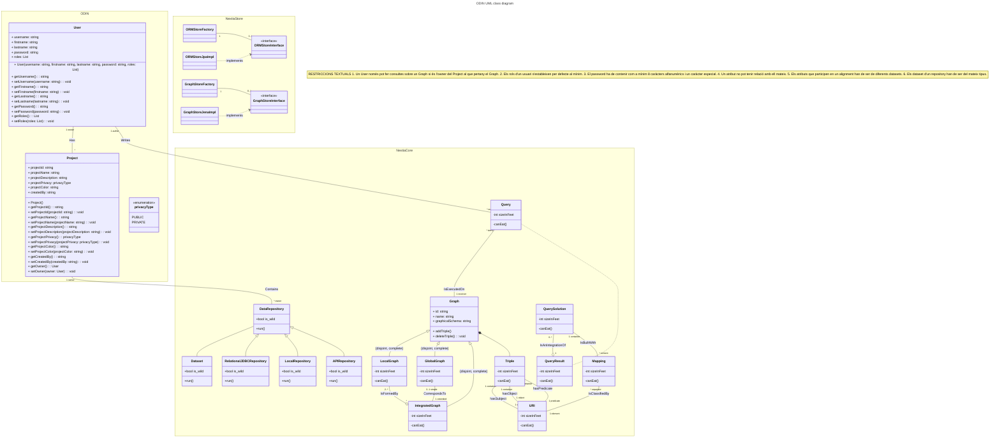

UML class diagram

```mermaid
---
title: ODIN UML class diagram
---
classDiagram
    note "
    RESTRICCIONS TEXTUALS
    1. Un User només pot fer consultes sobre un Graph si és l'owner del Project al que pertany el Graph.
    2. Els rols d'un usuari s'estableixen per defecte al mínim.
    3. El password ha de contenir com a mínim 8 caràcters alfanumèrics i un caràcter especial.
    4. Un atribut no pot tenir relació amb ell mateix.
    5. Els atributs que participen en un alignment han de ser de diferents datasets.
    6. Els dataset d'un repository han de ser del mateix tipus.
    
    "
    
    User "1 owner" -- "*" Project : Has
    User "1 author" -- "* queries" Query : Writes
    
    Project "1 owner" -- "* owner" DataRepository : Contains
    
namespace ODIN {
    class User {
        + username: string
        + firstname: string
        + lastname: string
        + password: string
        + roles: List<string>

        + User(username: string, firstname: string, lastname: string, password: string, roles: List<string>)
        + getUsername(): string
        + setUsername(username: string): void
        + getFirstname(): string
        + setFirstname(firstname: string): void
        + getLastname(): string
        + setLastname(lastname: string): void
        + getPassword(): string
        + setPassword(password: string): void
        + getRoles(): List<string>
        + setRoles(roles: List<string>): void
    }

    class Project {
        + projectId: string
        + projectName: string
        + projectDescription: string
        + projectPrivacy: privacyType
        + projectColor: string
        + createdBy: string

        + Project()
        + getProjectId(): string
        + setProjectId(projectId: string): void
        + getProjectName(): string
        + setProjectName(projectName: string): void
        + getProjectDescription(): string
        + setProjectDescription(projectDescription: string): void
        + getProjectPrivacy(): privacyType
        + setProjectPrivacy(projectPrivacy: privacyType): void
        + getProjectColor(): string
        + setProjectColor(projectColor: string): void
        + getCreatedBy(): string
        + setCreatedBy(createdBy: string): void
        + getOwner(): User
        + setOwner(owner: User): void
    }

    class privacyType {
        <<enumeration>>
        PUBLIC
        PRIVATE
    }
    
    
}

    ORMStoreFactory "1" -- "0..1" ORMStoreInterface
    ORMStoreJpaImpl ..> ORMStoreInterface : implements

    GraphStoreFactory "1" -- "0..1" GraphStoreInterface
    GraphStoreJenaImpl ..> GraphStoreInterface : implements
    
namespace NextiaStore {
    class ORMStoreFactory {
        
    }

    class ORMStoreInterface {
        <<interface>>

    }

    class ORMStoreJpaImpl {

    }

    class GraphStoreFactory {

    }

    class GraphStoreInterface {
        <<interface>>
    }

    class GraphStoreJenaImpl {

    }
}

    Graph <|-- LocalGraph : {disjoint, complete}
    Graph <|-- GlobalGraph : {disjoint, complete}
    Graph <|-- IntegratedGraph : {disjoint, complete}
    
    Graph *-- Triple
    
    Query "* query" -- "1 receiver" Graph : IsExecutedOn
    
    Query .. QueryResult
    QuerySolution "0..*" --o "1" QueryResult : IsAnIntegrationOf
    QuerySolution "1 container" -- "* content" Mapping : IsBuiltWith
    Mapping "* organizer"--"1 element" URI : IsClassifiedBy
    
    Triple "1 container" -- "1 subject" URI : hasSubject
    Triple "1 container" -- "1 object" URI : hasObject
    Triple "1 container" -- "1 predicate" URI : hasPredicate

    LocalGraph "2..*" --o "*" IntegratedGraph : IsFormedBy
    GlobalGraph "0..1 simple"--"1 extended" IntegratedGraph : CorrespondsTo
    
    DataRepository -- Dataset
    DataRepository <|-- RelationalJDBCRepository
    DataRepository <|-- LocalRepository
    DataRepository <|-- APIRepository
    
namespace NextiaCore {
    class QueryResult{
        -int sizeInFeet
        -canEat()
    }
    class QuerySolution{
        -int sizeInFeet
        -canEat()
    }
    class Mapping{
        -int sizeInFeet
        -canEat()
    }
    class Query{
        -int sizeInFeet
        -canEat()
    }
    
    class URI{
        -int sizeInFeet
        -canEat()
    }

    class Triple{
        -int sizeInFeet
        -canEat()
    }
    
    class Graph {
        + id: string
        + name: string
        + graphicalSchema: string

        + addTriple()
        + deleteTriple(): void
    }
    
    class LocalGraph{
        -int sizeInFeet
        -canEat()
    }
    class GlobalGraph{
        -int sizeInFeet
        -canEat()
    }
    class IntegratedGraph{
        -int sizeInFeet
        -canEat()
    }

    class DataRepository{
        +bool is_wild
        +run()
    }

    class Dataset{
        +bool is_wild
        +run()
    }

    class RelationalJDBCRepository{
        +bool is_wild
        +run()
    }
    
    class LocalRepository{
        +bool is_wild
        +run()
    }
    
    class APIRepository{     
        +bool is_wild
        +run()
    }

}

```